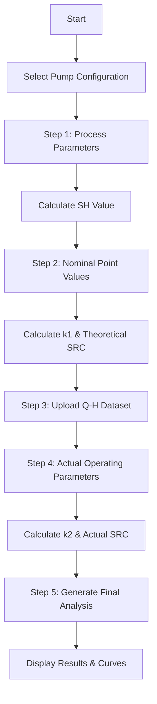

# Industrial Pump Management System

A comprehensive web application for industrial pump management, featuring three main processes: Energy Optimization, Reverse Engineering, and Inventory Minimization. The system provides multi-step forms, real-time calculations, SRC curve generation, and inventory management capabilities.

## 📋 Table of Contents

- [Overview](#overview)
- [Features](#features)
- [Technology Stack](#technology-stack)
- [Project Structure](#project-structure)
- [Installation](#installation)
- [Configuration](#configuration)
- [Usage](#usage)
- [API Documentation](#api-documentation)
- [Form Flow](#form-flow)
- [SRC Calculations](#src-calculations)
- [Troubleshooting](#troubleshooting)
- [Contributing](#contributing)

## 🎯 Overview

The Industrial Pump Management System is designed to help engineers and technicians manage all aspects of industrial pump operations. The system provides three main processes:

### 🔋 Energy Optimization
Analyze pump performance by comparing theoretical vs actual operating conditions. Calculate SRC (System Resistance Curve) values and generate comparative curves for performance analysis.

### 🔄 Reverse Engineering
Reverse engineer industrial pumps (BB3, BB4, BB5 multistage pumps and vertical pumps) to restore functionality, extend pump life, and optimize operations while reducing replacement costs.

### 📦 Inventory Minimization
Manage pump spare parts inventory with intelligent search, cart functionality, and optimization tools to reduce inventory costs while maintaining operational readiness.

### Key Capabilities
- **Multi-step Form Processing**: Step-by-step data collection with real-time validation
- **Real-time Calculations**: Instant calculations for energy optimization
- **File Upload Support**: Process Q-H curve data and technical drawings
- **Interactive Visualizations**: Display calculated curves and operating points
- **Inventory Management**: Search, filter, and manage spare parts
- **Authentication System**: Secure access control for different user types

## ✨ Features

### 🔐 Authentication & Access Control
- User login/logout functionality
- Role-based access control
- Session management
- Redirect handling for protected routes

### 🔋 Energy Optimization Analysis
- **Process Parameters**: Calculate SH (Shutoff Head) values
- **Nominal Point Analysis**: Extract Qnp, Hnp values from name plate data
- **Actual Operating Conditions**: Compare with theoretical performance
- **SRC Curve Generation**: Create theoretical and actual system resistance curves
- **Real-time Calculations**: Instant k1, k2, and SRC value calculations

### 🔄 Reverse Engineering Services
- **Pump Analysis**: BB3, BB4, BB5 multistage pumps and vertical pumps
- **Component Restoration**: Restore functionality without compromising performance
- **Technical Documentation**: Detailed engineering drawings and specifications
- **Cost Optimization**: Reduce replacement costs and extend pump life
- **Process Documentation**: Step-by-step reverse engineering workflow

### 📦 Inventory Minimization
- **Spare Parts Management**: Comprehensive inventory database
- **Intelligent Search**: Multi-field search across part names, numbers, and specifications
- **Cart Functionality**: Add items to cart with quantity management
- **Optimization Tools**: Reduce inventory costs while maintaining readiness
- **Real-time Updates**: Live inventory status and availability

### 🎨 User Interface
- Modern, responsive design with Tailwind CSS
- Interactive forms with real-time validation
- Loading states and progress indicators
- Error handling with user-friendly messages
- Mobile-responsive layout
- Shopping cart with scroll-to-cart functionality

### 📁 File Processing
- Excel/CSV file upload support
- Q-H curve data extraction
- Technical drawing uploads
- File validation and error handling

## 🛠 Technology Stack

### Frontend
- **React 18**: Modern React with hooks and functional components
- **React Router**: Client-side routing
- **Tailwind CSS**: Utility-first CSS framework
- **Framer Motion**: Animation library
- **Axios**: HTTP client for API calls
- **React Icons**: Icon library

### Backend
- **Django 4.x**: Python web framework
- **Django REST Framework**: API development
- **Djoser**: Authentication library
- **Pandas**: Data manipulation and analysis
- **NumPy**: Numerical computing
- **CORS**: Cross-origin resource sharing

### Development Tools
- **Node.js**: JavaScript runtime
- **npm**: Package manager
- **Python 3.x**: Backend runtime
- **Git**: Version control

## 📁 Project Structure

```
Project_test-master/
├── Backend/                          # Django backend
│   ├── backend/                      # Main Django project
│   │   ├── settings.py              # Django settings
│   │   ├── urls.py                  # Main URL configuration
│   │   └── wsgi.py                  # WSGI configuration
│   ├── pump_spares/                 # Main Django app
│   │   ├── models.py                # Database models
│   │   ├── views.py                 # API views
│   │   ├── urls.py                  # App URL patterns
│   │   ├── src_calculations.py     # SRC calculation logic
│   │   └── serializers.py           # Data serializers
│   ├── requirements.txt             # Python dependencies
│   └── manage.py                    # Django management script
├── src/                             # React frontend
│   ├── components/                  # Reusable components
│   ├── services/                    # API services
│   │   ├── authService.js          # Authentication service
│   │   └── energyOptimizationService.js
│   └── Website/                     # Main pages
│       ├── EnergyOptimization.jsx  # Main energy optimization page
│       ├── OperationalPhilosophy.jsx # Multi-step form
│       ├── InventoryDetails.jsx     # Inventory management
│       ├── ReverseEngineering.jsx  # Reverse engineering page
│       └── *.css                   # Component styles
├── public/                          # Static assets
│   ├── images/                      # Image files
│   └── *.pdf                        # PDF documents
├── package.json                     # Node.js dependencies
└── README.md                        # This file
```

## 🚀 Installation

### Prerequisites
- Node.js (v16 or higher)
- Python 3.8 or higher
- pip (Python package manager)
- Git

### Backend Setup

1. **Navigate to Backend directory**
   ```bash
   cd Backend
   ```

2. **Create virtual environment**
   ```bash
   python -m venv venv
   ```

3. **Activate virtual environment**
   ```bash
   # Windows
   venv\Scripts\activate
   
   # macOS/Linux
   source venv/bin/activate
   ```

4. **Install dependencies**
   ```bash
   pip install -r requirements.txt
   ```

5. **Run database migrations**
   ```bash
   python manage.py migrate
   ```

6. **Start Django server**
   ```bash
   python manage.py runserver 8000
   ```

### Frontend Setup

1. **Navigate to project root**
   ```bash
   cd Project_test-master
   ```

2. **Install dependencies**
   ```bash
   npm install
   ```

3. **Start development server**
   ```bash
   npm start
   ```

## ⚙️ Configuration

### Environment Variables

Create a `.env.local` file in the project root:

```env
# Backend Configuration
REACT_APP_API_URL=http://localhost:8000
REACT_APP_BACKEND_URL=http://localhost:8000

# Authentication
REACT_APP_JWT_SECRET=your_jwt_secret_key
REACT_APP_SESSION_TIMEOUT=3600000

# File Upload
REACT_APP_MAX_FILE_SIZE=10485760
REACT_APP_ALLOWED_FILE_TYPES=.xlsx,.xls,.csv
```

### Django Settings

Key settings in `Backend/backend/settings.py`:

```python
# Installed Apps
INSTALLED_APPS = [
    'django.contrib.admin',
    'django.contrib.auth',
    'django.contrib.contenttypes',
    'django.contrib.sessions',
    'django.contrib.messages',
    'django.contrib.staticfiles',
    'rest_framework',
    'corsheaders',
    'djoser',
    'pump_spares',
]

# CORS Settings
CORS_ALLOWED_ORIGINS = [
    "http://localhost:3000",
    "http://127.0.0.1:3000",
]

# Authentication
DJOSER = {
    'SERIALIZERS': {
        'user_create': 'pump_spares.serializers.UserCreateSerializer',
    },
}
```

## 📖 Usage

### 1. Accessing the Application

1. Open your browser and navigate to `http://localhost:3000`
2. You'll see the main navigation with three main processes:
   - **Energy Optimization**: Pump performance analysis tool
   - **Reverse Engineering**: Pump reverse engineering services
   - **Inventory Minimization**: Spare parts inventory management

### 2. Energy Optimization Workflow

#### Step 1: Process Parameters
1. Navigate to Energy Optimization page
2. Click "Access Energy Optimization" (requires login)
3. Select your pump configuration:
   - **1R + 1S**: 1 Running & 1 StandBy
   - **2R + 2S**: 2 Running & 2 StandBy
   - **MR + MS**: Multiple Running & Multiple StandBy

4. Fill in Process Parameters:
   - DA Tank Height (h1)
   - Boiler Drum Height (h2)
   - DA Tank Pressure (P1)
   - Boiler Drum Pressure (P2)
   - Feed Water Temperature (t)
   - Specific Gravity (SG)

5. Click "Calculate SH Value & Proceed"
   - System calculates: `SH = (h2 - h1) + ((P2 - P1) * 10.2) / SG`

#### Step 2: Nominal Point Values
1. Enter Name Plate Reading data:
   - **Qnp** (Nominal Flow): e.g., 120 m³/hr
   - **Hnp** (Nominal Head): e.g., 130 m
   - **BKWnp** (Nominal Power): e.g., 10 kW
   - **ηnp** (Nominal Efficiency): e.g., 15%
   - **N1** (Rated Speed): e.g., 2900 rpm

2. Click "🔢 Calculate k1 & SRC Values"
   - System calculates: `k1 = (Hnp - SH) / Qnp²`

#### Step 3: File Upload
1. Upload Q-H Curve Dataset:
   - **Format**: Excel (.xlsx) or CSV (.csv)
   - **Structure**: Flow (Q) in column 1, Head (H) in column 2
   - **Purpose**: Provides Qi range for curve plotting

#### Step 4: Actual Operating Parameters
1. Enter actual operating conditions:
   - **Qact** (Actual Flow Required)
   - **Hact** (Actual Discharge Pressure)
   - **N2** (Actual running Speed)
   - **Actual Power Consumption**

2. Click "🔢 Calculate k2 & Actual SRC Values"
   - System calculates: `k2 = (Hact - SH) / Qact²`

#### Step 5: Generate Final Analysis
1. Click "🚀 Process Q-H Curve & Generate SRC"
2. System generates:
   - Theoretical SRC curve: `SRC = SH + k1 × Q²`
   - Actual SRC curve: `SRC = SH + k2 × Q²`
   - Comparative analysis

### 3. Reverse Engineering Workflow

#### Step 1: Access Reverse Engineering
1. Navigate to Reverse Engineering page
2. Review the service overview and process details
3. Click "Access Reverse Engineering" (requires login)

#### Step 2: Pump Analysis Process
1. **Initial Assessment**: Analyze pump condition and requirements
2. **Technical Documentation**: Review existing drawings and specifications
3. **Component Analysis**: Identify worn or failed components
4. **Engineering Design**: Create new designs based on analysis
5. **Manufacturing**: Produce replacement components
6. **Testing & Validation**: Ensure components meet specifications
7. **Installation Support**: Provide installation guidance

#### Supported Pump Types
- **BB3 Multistage Pumps**: Horizontal multistage centrifugal pumps
- **BB4 Multistage Pumps**: High-pressure multistage pumps
- **BB5 Multistage Pumps**: Vertical multistage pumps
- **Vertical Pumps**: Various vertical pump configurations

#### Benefits
- **Reduced Downtime**: Faster restoration than OEM replacement
- **Cost Savings**: Significant cost reduction compared to new pumps
- **Extended Life**: Optimize pump performance and longevity
- **Custom Solutions**: Tailored solutions for specific requirements

### 4. Inventory Minimization Workflow

#### Step 1: Access Inventory Management
1. Navigate to Inventory Minimization page
2. View the inventory dashboard with search functionality
3. Access is available without login for browsing

#### Step 2: Search and Filter
1. **Search Functionality**: 
   - Search by part name, part number, drawing number
   - Filter by MOC (Material of Construction)
   - Filter by reference location
   - Filter by drawing vendor

2. **Advanced Filters**:
   - Material specifications
   - Size and dimensions
   - Availability status
   - Cost ranges

#### Step 3: Cart Management
1. **Add to Cart**: Click on items to add to shopping cart
2. **Quantity Management**: Adjust quantities as needed
3. **Cart Summary**: View cart contents and total
4. **Cart Navigation**: Click cart icon to scroll to cart section

#### Step 4: Inventory Optimization
1. **Cost Analysis**: Review inventory costs and optimization opportunities
2. **Usage Patterns**: Analyze usage patterns for better planning
3. **Reorder Points**: Set optimal reorder points for critical parts
4. **Supplier Management**: Manage supplier relationships and pricing

#### Key Features
- **Real-time Search**: Instant search results as you type
- **Multi-field Search**: Search across multiple part attributes
- **Cart Functionality**: Add items to cart with quantity management
- **Scroll to Cart**: Click cart icon to automatically scroll to cart
- **Responsive Design**: Works on desktop and mobile devices

## 🔌 API Documentation

### Authentication Endpoints

#### Login
```http
POST /api/auth/login/
Content-Type: application/json

{
    "username": "your_username",
    "password": "your_password"
}
```

#### Logout
```http
POST /api/auth/logout/
```

### Energy Optimization Endpoints

#### Calculate SRC Curves
```http
POST /api/calculate-src-curves/
Content-Type: multipart/form-data

Form Data:
- shValue: float (Shutoff Head value)
- qnp: float (Nominal Flow)
- hnp: float (Nominal Head)
- qact: float (Actual Flow)
- hact: float (Actual Head)
- qhFile: file (Q-H curve file)
```

**Response:**
```json
{
    "success": true,
    "qnp": 120.0,
    "hnp": 130.0,
    "k1": 0.0083,
    "k2": 0.0125,
    "theoreticalSRC": [
        {"q": 0, "src": 100.0},
        {"q": 12, "src": 101.2},
        ...
    ],
    "actualSRC": [
        {"q": 0, "src": 100.0},
        {"q": 12, "src": 101.8},
        ...
    ],
    "operatingPoint": {
        "qact": 43.0,
        "hact": 125.0
    }
}
```

## 📊 Form Flow

### Multi-Step Process



### Data Flow

1. **Input Collection**: User fills form fields
2. **Real-time Validation**: Fields validated as user types
3. **Calculation Triggers**: Manual buttons for k1/k2 calculations
4. **File Processing**: Upload and parse Q-H curve data
5. **Backend Processing**: SRC curve generation
6. **Result Display**: Show calculated values and curves

## 🧮 SRC Calculations

### Mathematical Formulas

#### Shutoff Head (SH)
```
SH = (h2 - h1) + ((P2 - P1) × 10.2) / SG
```
Where:
- h1: DA Tank Height from Pump Center line
- h2: Boiler Drum Height from Pump Center line
- P1: DA Tank Pressure
- P2: Boiler Drum Pressure
- SG: Specific Gravity

#### Theoretical Coefficient (k1)
```
k1 = (Hnp - SH) / Qnp²
```
Where:
- Hnp: Nominal Head
- Qnp: Nominal Flow

#### Actual Coefficient (k2)
```
k2 = (Hact - SH) / Qact²
```
Where:
- Hact: Actual Head
- Qact: Actual Flow

#### SRC Curves
```
Theoretical SRC = SH + k1 × Q²
Actual SRC = SH + k2 × Q²
```

### Calculation Process

1. **Data Validation**: Ensure all required fields are filled
2. **Coefficient Calculation**: Compute k1 and k2 values
3. **Curve Generation**: Generate 21 data points for smooth curves
4. **Range Determination**: Use max(Qnp, Qact) × 1.2 as maximum flow
5. **Result Storage**: Store calculated values in state

## 🔧 Troubleshooting

### Common Issues

#### 1. Button Not Working
**Problem**: "Process Q-H Curve & Generate SRC" button not responding

**Solutions**:
- Check browser console (F12) for error messages
- Ensure all required fields are filled
- Verify file upload is successful
- Check if backend server is running on port 8000

#### 2. Backend Connection Issues
**Problem**: Frontend cannot connect to backend

**Solutions**:
- Verify Django server is running: `python manage.py runserver 8000`
- Check CORS settings in Django settings
- Ensure no firewall blocking port 8000
- Check network connectivity

#### 3. File Upload Problems
**Problem**: Q-H curve file not uploading

**Solutions**:
- Verify file format (.xlsx, .xls, .csv)
- Check file size (max 10MB)
- Ensure file has correct structure (Flow in column 1, Head in column 2)
- Check browser console for upload errors

#### 4. Calculation Errors
**Problem**: k1/k2 calculations showing incorrect values

**Solutions**:
- Verify input values are positive numbers
- Check for division by zero (Qnp or Qact = 0)
- Ensure SH value is calculated from Step 1
- Validate data types and ranges

### Debug Mode

Enable debug logging by adding to browser console:
```javascript
localStorage.setItem('debug', 'true');
```

### Server Logs

Check Django server logs for backend errors:
```bash
# In Backend directory
python manage.py runserver 8000 --verbosity=2
```

## 🤝 Contributing

### Development Setup

1. **Fork the repository**
2. **Create feature branch**
   ```bash
   git checkout -b feature/new-feature
   ```
3. **Make changes and test**
4. **Commit changes**
   ```bash
   git commit -m "Add new feature"
   ```
5. **Push to branch**
   ```bash
   git push origin feature/new-feature
   ```
6. **Create Pull Request**

### Code Standards

- **Frontend**: Use functional components with hooks
- **Backend**: Follow Django best practices
- **Styling**: Use Tailwind CSS classes
- **Documentation**: Update README for new features

### Testing

Run tests before submitting:
```bash
# Frontend tests
npm test

# Backend tests
python manage.py test
```

## 📄 License

This project is licensed under the MIT License - see the LICENSE file for details.

## 📞 Support

For support and questions:
- **Email**: info@allitexpert.com
- **Documentation**: This README file
- **Issues**: Create GitHub issues for bugs and feature requests

---

**Last Updated**: September 2024
**Version**: 1.0.0